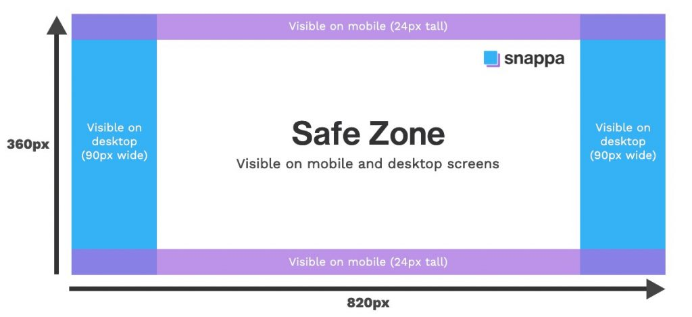

# Notes







## Facebook Page

### Profile Photo


**170\*170** is the Size of Profile Picture. \(128\*128 on desktop\)


**170\*170** is the Size of Profile Picture. 

How ever you can use even **1024 \* 1024**.


Since profile picture is shown in circle shape make circle guide and place your logo within it.


### Cover

851\*315 PX \(Recommended\)

* Desktop size : 820\*312
* Mobile Phone : 640\*360
* Minimum Size : 400\*150

So it is better use below structure.

* File type: PNG \(Recommended\) or JPEG
* Ideal file size : 100 KB
* Use the recommended pixel sizes for the fastest load times.

### Posts

Facebook automatically resizes and formats your photos when they are uploaded for the timeline to be 500 pixels wide and to fit the 1.91:1 aspect ratio.

But avoid pixilation or slow load times by remembering these sizes:

* **Recommended size:** 1200 x 630 pixels
* **Minimum size:** 600 x 315 pixels

#### Tips:

* If you are sharing 2-10 images in your brand’s Facebook post using the carousel display, images should be **1200 x 1200**.
* This is a 1:1 ratio.


1200\*1200 is my fav


### Event cover photos: 1200 x 628 pixels \(recommended\)

#### Tips

* This is about a 2:1 ratio.
* The size of your event cover photo [can’t be edited after it’s been added to an event](https://www.facebook.com/help/1910675759253872?rdrhc).

### Panorama or 360 photos:

* **Minimum image size:** Facebook says that it should be [“30,000 pixels in any dimension, and less than 135,000,000 pixels in total size.”](https://facebook360.fb.com/editing-360-photos-injecting-metadata/)
* **Aspect ratio:** 2:1

#### Tips

* Facebook automatically recognizes and processes these images based on “camera-specific metadata found in photos taken using 360-ready devices.”
* Files for these Facebook images can be up to 45 MB for JPEGs or 60 MB for PNGs.
* Facebook recommends using JPEGs for 360 photos and ensuring files aren’t bigger than 30 MB.

### Facebook Stories: 1080 x 1920 pixels \(recommended\)

#### Tips

* Facebook Stories take up the full screen of a phone. That’s an aspect ratio of 9:16.
* Don’t choose an image with a width smaller than 500 pixels.
* For Stories with text, consider leaving 14% of the top and bottom text-free. \(That’s 250 pixels.\) That way any call-to-action won’t be covered by your brand’s profile photo or buttons.

## LinkedIn

### Cover Image : 

1,128px x 191px Recommended

